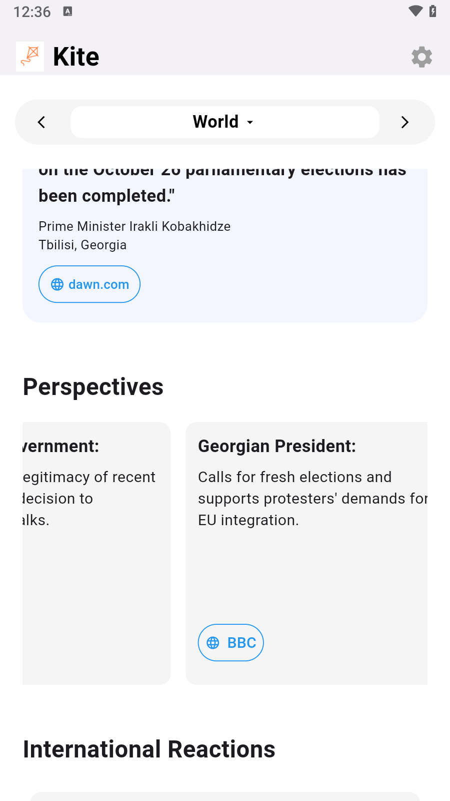
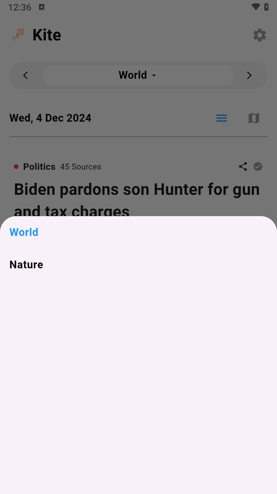

# Kite News Project

A Flutter project that shows the news from Kite API.

## How to install and run

1. Make sure that you installed `flutter` on your machine.

2. Run the command as follows:

```$
git clone https://github.com/frozenstar0301/kite_news
cd ./kite_news
flutter clean
flutter pub get
flutter build apk
```

3. You can install the apk that generated while building. (Directory: `[Proejct]/build/app/outputs/flutter-apk/app-release.apk`)

## How it looks like


<br/>

<br/>

<br/>

<br/>

<br/>
